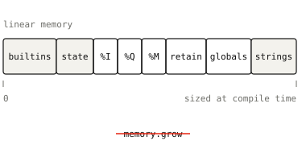
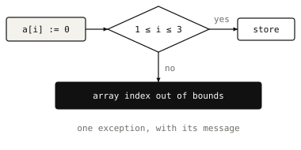
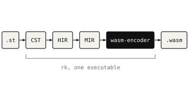

# Rk 'Rukbat'

> Or __Alpha Sagittarii__  💫

<strong>Rk</strong> is an IEC-61131-3 Structured Text toolchain that compiles to WebAssembly, focused on strictness and portability.

 

 - See [diagnostics](https://rk.clauzeladrien2170.workers.dev/diagnostics) for error codes.

 - See [official documentation](https://rk.clauzeladrien2170.workers.dev) to learn about _**formatter**_ and _**linter**_.

## Why WebAssembly ?

###  **Portable**
One unique binary that can be loaded in any runtime.

###  **Sandboxed**
WebAssembly modules are sandboxed by default, errors are caught but do not propagate to the host.

###  **Agnostic host**
In any language, on any [platform](https://withbighair.com/webassembly/2025/05/11/Runtime-choices.html) with a WASM runtime.

## The compiler in a nutshell

### **Expressive**

Namespaces, overloaded functions, classes and interfaces, references and unit tests.

### **Text only**

No limitations on how your code can be organized, see [Namespaces](docs/namespaces.md)

### **Highly strict**

  
Built with strictness as its core, with 220+ diagnostics.

### **One core module, with memory dedicated once**

  
No allocator, no GC, nothing calls `memory.grow`, so the footprint is settled at compile time.

### **Bundled traps**

  
Array, subrange bounds, and dereference checks are generated inside the binary, once spotted, they trigger a **WebAssembly exception**.

### **Lightweight**

  
Rk does not depend on any compiler backend except wasm-encoder. This makes the compiler very lightweight __(28 MB for the whole executable)__.
  
> [!TIP]
> The CLI provides [binaryen](https://github.com/webassembly/binaryen) as an optional tool you can use to optimize binaries, see [Profiles](docs/profiles.md).

## License

rk is distributed under [AGPL-3.0-only](LICENSE).
For the Apache-2.0 exceptions, the permission that makes every generated module yours,
and commercial licensing, see [LICENSING.md](LICENSING.md).
